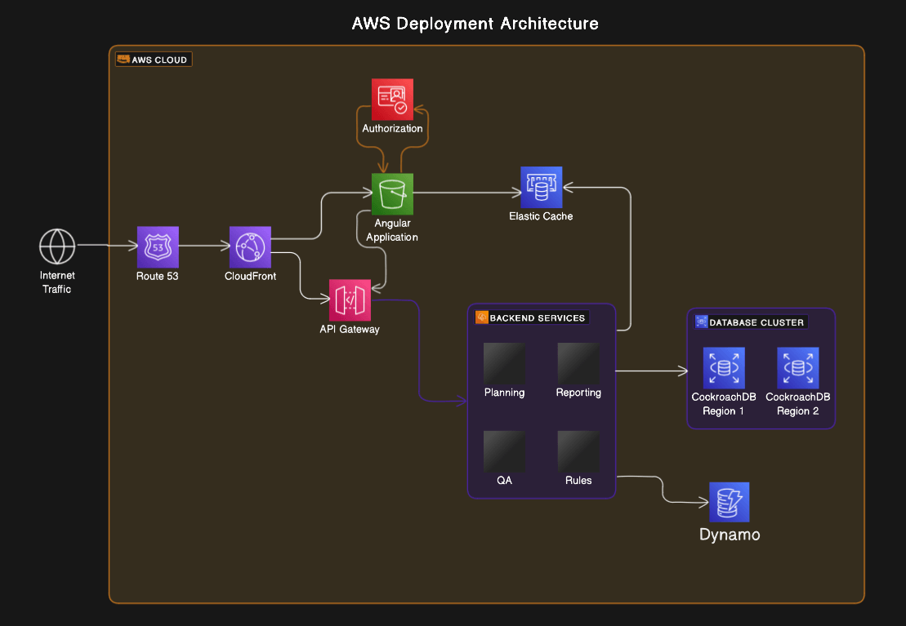

# ALLIANCE RESEARCH INDICATORS MAIN

# Table of Contents

1. [Backend API Tech Stack](#backend-api-tech-stack)
   - [Programming language](#programming-language)
   - [Framework](#framework)
   - [Build tool](#build-tool)
   - [Code coverage tool](#code-coverage-tool)
   - [Static code analysis](#static-code-analysis)
   - [Dependency management](#dependency-management)
   - [Dependency vulnerability scanning](#dependency-vulnerability-scanning)
   - [Unit testing](#unit-testing)
   - [API testing framework](#api-testing-framework)
   - [API documentation](#api-documentation)
2. [Architecture Diagram](#architecture-diagram)
3. [Cross-Functional Requirements](#cross-functional-requirements)
   - [Scalability](#scalability)

## Backend API Tech Stack

### Programming language

TypeScript is a statically typed superset of JavaScript that compiles to plain JavaScript. It offers static type checking, which enhances code quality and developer productivity. TypeScript provides type safety and better tooling for building robust backend applications. Alternatives: JavaScript lacks static typing, which can lead to more runtime errors.

### Framework

Nest.js is a progressive Node.js framework for building efficient and scalable server-side applications. It leverages TypeScript and follows modular architecture principles. Nest.js provides built-in support for dependency injection, middleware, and decorators, making it ideal for building RESTful APIs. Alternatives: Express.js is another popular framework, but Nest.js offers more structure and features out of the box.

### Build tool

TypeScript Compiler (tsc) is the official TypeScript compiler that translates TypeScript code into JavaScript. It checks for syntax errors and emits clean JavaScript code. tsc is the standard build tool for TypeScript projects and seamlessly integrates with TypeScript workflows. Alternatives: Babel can also transpile TypeScript code, but tsc is preferred for its close integration with TypeScript.

### Code coverage tool

Istanbul is a code coverage tool for JavaScript applications. It instruments code to track which parts have been executed during testing. Istanbul provides accurate code coverage metrics and integrates well with testing frameworks like Jest. Alternatives: Blanket.js is another code coverage tool, but Istanbul is more widely used and supported.

### Static code analysis

ESLint is a highly configurable static analysis tool for identifying problematic patterns in JavaScript code. It enforces consistent coding styles and helps catch errors early. ESLint offers extensive customization options and supports TypeScript out of the box. Alternatives: TSLint is deprecated in favor of ESLint for TypeScript projects.

### Dependency management

npm is the default package manager for Node.js. It manages dependencies and facilitates package installation, versioning, and dependency resolution. npm has a vast ecosystem of packages and is tightly integrated with Node.js development workflows. Alternatives: Yarn is another package manager, but npm is preferred for its widespread adoption and compatibility.

### Dependency vulnerability scanning

npm Audit is a built-in feature of npm that scans dependencies for known vulnerabilities. It provides actionable insights and recommendations for securing the application. npm Audit seamlessly integrates with npm and provides comprehensive vulnerability scanning without additional setup. Alternatives: Snyk offers similar functionality but requires additional configuration and integration.

### Unit testing

Jest is a popular testing framework for JavaScript applications. It provides a delightful testing experience with features like snapshot testing, mocking, and code coverage. Jest offers an all-in-one solution for unit testing with built-in assertion libraries and comprehensive test reporting. Alternatives: Mocha requires additional configuration and setup compared to Jest.

### API testing framework

Supertest is a high-level abstraction for testing HTTP servers in Node.js. It provides a fluent API for making HTTP requests and assertions. Supertest integrates well with testing frameworks like Jest and provides a simple and expressive syntax for API testing. Alternatives: Postman offers similar functionality but is more suitable for manual testing and API documentation.

### API documentation

Swagger is an open-source framework for designing, building, and documenting RESTful APIs. It provides tools for generating interactive API documentation from OpenAPI specifications. Swagger simplifies API documentation by automatically generating documentation from code annotations and comments. Alternatives: RAML and API Blueprint are alternatives to Swagger but are less widely adopted.

### Architecture Diagram

### Cross-Functional Requirements

#### Scalability

Description: The system should be able to handle increasing loads and user traffic without compromising performance or availability.

Best Practices:

- Use auto-scaling features provided by AWS Elastic Beanstalk to automatically adjust the number of instances based on demand.
- Implement efficient caching mechanisms to reduce the load on backend services.

Example: The system automatically scales up during peak hours and scales down during periods of low activity.

Tools: AWS Elastic Beanstalk, AWS Auto Scaling, Redis for caching.

#### Security

Description: The system should ensure the confidentiality, integrity, and availability of data and resources.

Best Practices:

- Implement encryption for data in transit and at rest using SSL/TLS and encryption at the database level.
- Implement role-based access control (RBAC) to restrict access to sensitive resources.

Example: User authentication and authorization mechanisms are in place to prevent unauthorized access to sensitive data.

Tools: AWS Cognito, AWS IAM, SSL/TLS certificates, AWS Key Management Service (KMS).

#### Reliability

Description: The system should be highly reliable, with minimal downtime and disruptions.

Best Practices:

- Implement fault-tolerant architecture with redundancy at different levels of the system.
- Set up automated backups and disaster recovery mechanisms for critical data and services.

Example: The system is designed to withstand hardware failures and network outages without impacting user experience.

Tools: AWS Elastic Beanstalk, AWS RDS Multi-AZ deployment, AWS Backup.

#### Performance

Description: The system should deliver fast response times and low latency for user requests.

Best Practices:

- Optimize frontend and backend code for efficiency and speed.
- Use content delivery networks (CDNs) to cache and deliver static assets closer to users.

Example: The average response time for API requests is under 100 milliseconds.

Tools: Performance monitoring tools like AWS CloudWatch, New Relic, CDN providers like AWS CloudFront.

#### Maintainability

Description: The system should be easy to maintain, update, and troubleshoot.

Best Practices:

- Follow coding standards and best practices for clean, modular, and well-documented code.
- Use automation for deployment, testing, and infrastructure management.

Example: The system architecture is well-documented, and changes can be easily understood and implemented by the development team.

Tools: Code quality tools like ESLint, automated testing frameworks like Jest, infrastructure as code tools like AWS CloudFormation.

#### Monitoring

Description: The system should provide comprehensive monitoring and logging capabilities to track performance, detect issues, and troubleshoot problems.

Best Practices:

- Set up centralized logging to capture and analyze logs from different components of the system.
- Use monitoring tools to monitor key metrics, set up alerts, and respond to incidents proactively.

Example: The system generates alerts when CPU utilization exceeds a certain threshold or when error rates increase.

Tools: AWS CloudWatch, ELK Stack (Elasticsearch, Logstash, Kibana), Prometheus.

#### Cost Optimization

Description: The system should be cost-effective, with efficient resource utilization and minimal waste.

Best Practices:

- Optimize resource provisioning based on actual usage and demand patterns.
- Use cost management tools to analyze spending, identify cost-saving opportunities, and optimize resource allocation.

Example: Unused resources are identified and decommissioned to reduce costs without impacting performance.

Tools: AWS Cost Explorer, AWS Trusted Advisor, Cloud cost optimization platforms like CloudHealth.

#### High Availability

Description: The system should ensure continuous availability and resilience to failures.

Best Practices:

- Deploy resources across multiple availability zones (AZs) to distribute traffic and mitigate single points of failure.
- Implement load balancing and failover mechanisms to reroute traffic in case of failures.

Example: The system remains available even if one availability zone or component fails.

Tools: AWS Elastic Load Balancing (ELB), AWS Route 53, Multi-AZ deployments for database.

#### Data Integrity

Description: The system should maintain the accuracy and consistency of data across different components and interactions.

Best Practices:

- Implement data validation and verification mechanisms to ensure the correctness of input and output data.
- Use transactions and database constraints to enforce data integrity constraints.

Example: Data stored in the database remains consistent and accurate, even under high concurrency and concurrent updates.

Tools: Database management systems like MySQL, CockroachDB, data validation libraries.

#### Version Control

Description: The system should utilize version control to manage and track changes to source code and configurations.

Best Practices:

- Use a version control system (e.g., Git) to manage source code repositories and track changes over time.
- Implement branching strategies and merge workflows to facilitate collaboration and code review.

Example: All changes to the codebase are tracked through version control, with clear documentation and commit messages.

Tools: Git, GitHub.

#### Documentation

Description: The system should be well-documented to facilitate understanding, usage, and maintenance.

Best Practices:

- Document architectural decisions, design patterns, and system components.
- Provide developer documentation, API references, and deployment guides.

Example: Architecture diagrams, API documentation, and deployment instructions are available for reference.

Tools: Notion, Confluence (JIRA), Swagger/OpenAPI for API documentation.

#### Compliance

Description: The system should adhere to relevant laws, regulations, and industry standards.

Best Practices:

- Stay updated with legal and regulatory requirements relevant to the system and industry.
- Implement security and privacy measures to protect sensitive data and ensure compliance with standards like GDPR, HIPAA, etc.

Example: Personal data is handled in compliance with GDPR regulations, with appropriate consent mechanisms and data protection measures.

Tools: Compliance management frameworks, auditing tools, legal consultation.

#### Interoperability

Description: The system should be compatible and able to communicate with external systems and services.

Best Practices:

- Follow standard protocols and formats for data exchange and integration (e.g., RESTful APIs, JSON).
- Use industry-standard authentication and authorization mechanisms for secure integration.

Example: The system integrates seamlessly with third-party services and APIs using standard protocols.

Tools: RESTful API standards, OAuth 2.0 for authentication, API gateways.

#### Performance Testing

Description: The system should undergo performance testing to validate its ability to meet performance requirements under expected loads.

Best Practices:

- Define performance metrics and scenarios based on expected usage patterns and peak loads.
- Conduct load testing, stress testing, and scalability testing to assess system performance and identify bottlenecks.

Example: Performance tests simulate high user traffic and measure response times, throughput, and resource utilization.

Tools: Apache JMeter, Gatling, Locust.

#### Continuous Integration/Continuous Deployment (CI/CD)

Description: The system should implement CI/CD pipelines to automate the build, test, and deployment processes.

Best Practices:

- Set up automated build and test pipelines to validate changes before deployment.
- Use deployment automation tools to deploy changes to production with minimal manual intervention.

Example: Code changes are automatically tested, validated, and deployed to production environments.
